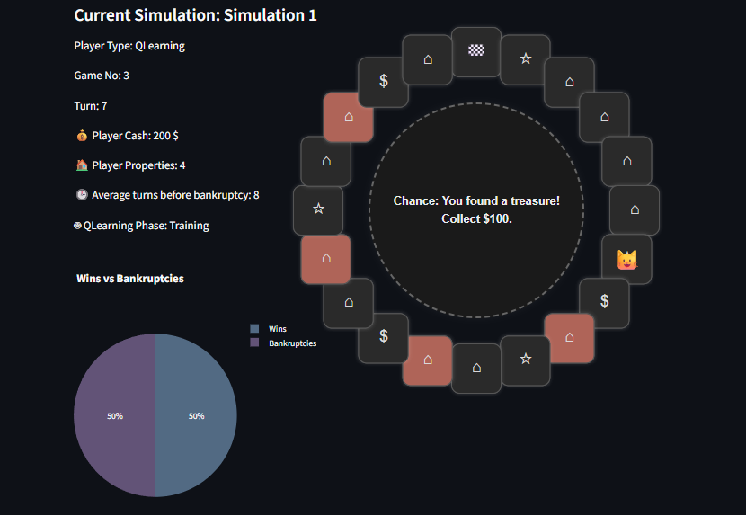

# MonopolySimulation

This is a Python project that simulates the classic board game Monopoly in single player version. It models player actions, property transactions, and game mechanics to analyze strategies and outcomes. 

Technology stack: Python, streamlit

Full project documentation is available in [wiki 📖](https://github.com/kmazrolina/MonopolySimulation/wiki).




## Quick start
Clone this repository:
```bash
git clone https://github.com/kmazrolina/MonopolySimulation
```
Install:
```bash
pip install -e .
```

**Run simulation visualization**
```bash
monopoly-sim
```
Open http://localhost:8502/ in your browser.


Configure simulation and run.


**Running experiments**

Running comparative experiments across 10000 games (might take a few minutes).

```bash
compare-players-strategies # Compare player types over 10000 games

compare-reward-strategies # Compare q-learning reward strategies

compare-start-cash # Compare starting cash amount 1000, 1500, 2000$

```
After running command open http://localhost:8502/ in your browser to start running the comparison.

Full information about experiment results [available here](https://github.com/kmazrolina/MonopolySimulation/wiki/Comparative-Experiments)

## Simulation Rules

### Board Setup
The board is a **circular track** with **20 spaces**.
Spaces include:
  - **1 Start space**: Players collect $200 each time they pass or land on it.
  - **12 Properties**: Each can be purchased for $250 and charges $50 rent.
  - **4 Chance spaces**: Landing here triggers a random Chance card effect.
  - **3 Tax spaces**: Landing here requires paying a fixed tax of $75.

### Starting Conditions
The player begins with chosen cash amount.

### Turn Structure
1. The player rolls a **six-sided die** (1-6).
2. The player moves forward by the number rolled.
3. The action taken depends on the space landed on:

#### Properties
- If the property is **unowned** that could be bought
- If the property is **owned** (by the player) - rent is collected. Rent is fixed at $50 for each property.


#### Chance Spaces
- Landing on a Chance space triggers drawing a Chance card with one of at least 3 possible effects, such as:
- "Gain $100"
- "Pay $150"
- "Go back 3 spaces"

#### Tax Spaces
The player must pay a tax of **$75** immediately upon landing.

#### Passing Start
The player collects **$200** every time they pass or land on the Start space.

### Game End Conditions
The game ends if:
- The player goes **bankrupt** (cash less than zero).
- The player completes all turns without going bancrupt.

## Player Types
- Always Buy - always buys unowned properties
- Never Buy - never buys unowned properties
- QLearning - learns when to buy properties to maximize total worth and number of wins

More information on the learning process [available here](https://github.com/kmazrolina/MonopolySimulation/wiki/QLearning-Agent)

Agent Evaluation Report is [available here](https://github.com/kmazrolina/MonopolySimulation/wiki/AI-Agent-Evaluation)


## System desing
The Simulation.run() (see `monopoly_simulation/simulation.py`) method pushes events to a event queue which are later parsed by user interface or experiment scripts. 
Streamlit is a sequential framework which is not ideal (or even not recommended) for dynamic simulation environments however running one simulation of this simple game is fast, morover streamlit offers simple and elegant interface design with minimal python code. 

### Possible improvements
- Replacing streamlit with async display
- Replacing simple deque() for simulation event with messsaging solutions like Apache Kafka
- Allowing for more options to be configured by user eg. board size - which is prepared to be scalable in backedn desing however not implemented in forntend yet
